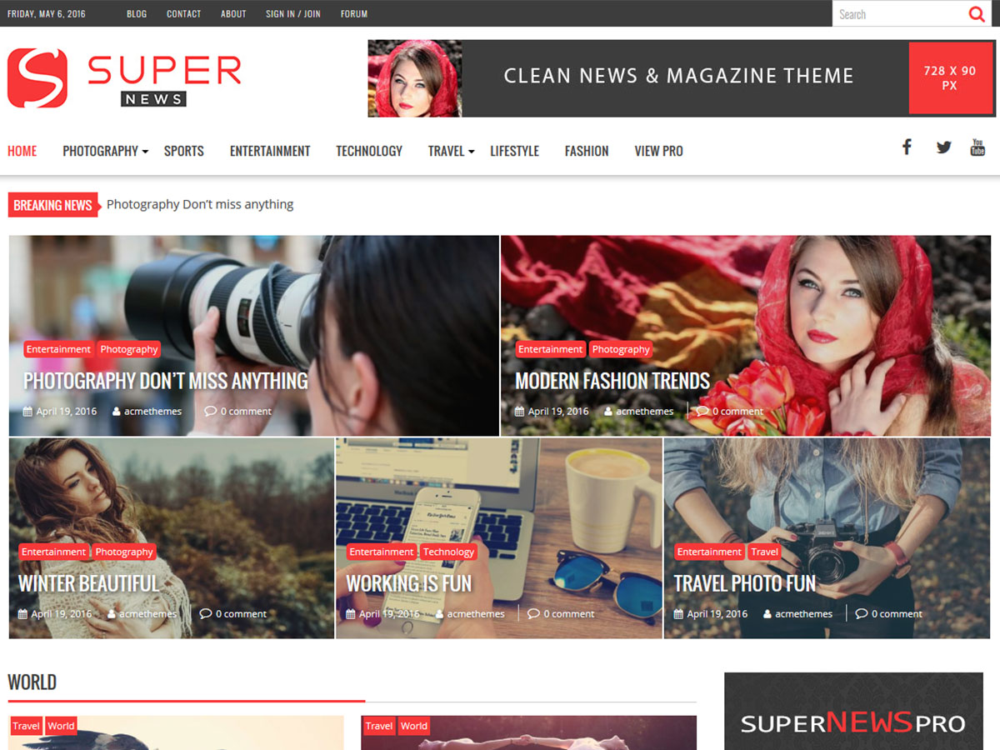

# SuperNews

**Contributors:** acmethemes  
**Requires at least:** 6.6  
**Tested up to:** 7.0  
**Requires PHP:** 7.4  
**Stable tag:** 4.0.0  
**License:** GPLv2 or later  
**License URI:** https://www.gnu.org/licenses/gpl-2.0.html  

> 

SuperNews is a clean, fast-loading theme built for news portals, magazine sites, and content-driven blogs. It combines lightweight performance with a polished design — featuring a breaking news ticker, drag-and-drop widget areas, and front-page feature sections that put your top stories in the spotlight.

## Features

- **Breaking news ticker** — scroll latest headlines at the top of the page
- **Front-page feature section** — highlight top stories prominently
- **Drag-and-drop widget areas** — reorder homepage content visually
- **Advanced custom widgets** — purpose-built for news and magazine sites
- **Up to four-column layouts** — flexible category and post grids
- **Advertisement ready** — integrated ad slots throughout the layout
- **Custom colors & background** — match your publication's branding
- **Custom logo & menu** — full header control
- **Footer widgets** — categories, recent posts, and social links
- **Featured image control** — per-page image display options
- **Breadcrumb navigation** — clear, SEO-friendly structure
- **Lightweight & retina ready** — fast loading on all devices
- **Custom CSS** — advanced styling without a child theme
- **WooCommerce compatible** — sell subscriptions or merch
- **Translation ready** — .pot file included
- **RTL support** — right-to-left language compatible

## Installation

1. Download the theme zip file.
2. In your WordPress admin, go to **Appearance → Themes**.
3. Click **Add New** → **Upload Theme**.
4. Select the zip file and click **Install Now**.
5. Click **Activate**.

## Frequently Asked Questions

### How do I customize the front page?

Go to **Appearance → Customize → Front Page Options** to configure the featured section and homepage layout. Use **Appearance → Widgets** to arrange content blocks.

### Is there documentation?

Yes — visit the [SuperNews documentation](http://www.doc.acmethemes.com/supernews/) for detailed guides.

## Credits

SuperNews is built on [Underscores](https://underscores.me/) and licensed under GPLv2 or later. It bundles the following third-party resources:

- [Google Fonts](https://fonts.google.com/) — Apache License 2.0
- [Font Awesome](https://fontawesome.com/) — MIT / SIL OFL 1.1
- [normalize.css](https://necolas.github.io/normalize.css/) — MIT
- [BxSlider](https://bxslider.com/) — MIT
- [SlickNav](https://github.com/ComputerWolf/SlickNav) — MIT
- [Theia Sticky Sidebar](https://github.com/WeCodePixels/theia-sticky-sidebar) — MIT
- [Breadcrumb Trail](https://github.com/justintadlock/breadcrumb-trail) — GPLv2+
- [TGM Plugin Activation](http://tgmpluginactivation.com/) — GPLv2+
- [html5shiv](https://github.com/afarkas/html5shiv) — MIT
- [Respond.js](https://github.com/scottjehl/Respond) — MIT

---

[Demo](http://www.demo.acmethemes.com/supernews/) &middot; [Support](https://www.acmethemes.com/supports/) &middot; [Acme Themes](https://www.acmethemes.com)
